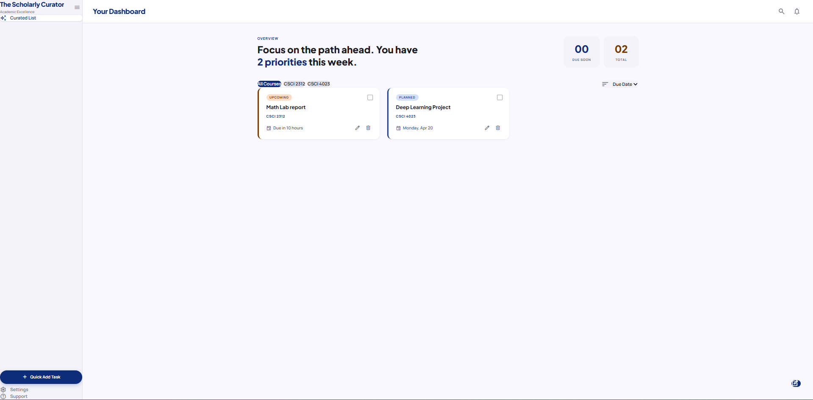

# The Scholarly Curator — Study Planner & Assignment Tracker

A full-stack web application for tracking assignments, due dates, and completion status. Built with Flask (Python) and React + Vite for the CU Denver Honors Contract — CSCI 3508 Spring 2026.

---

## Features

- Add assignments with title, course, due date, and priority (Low / Medium / High)
- View all assignments in a card grid with color-coded status badges (Urgent / Upcoming / Planned / Done)
- Relative due-time display ("in 2 days", "3 hours ago")
- Edit any assignment's fields inline via modal form
- Mark assignments complete / incomplete
- Delete assignments
- Sort by due date or priority
- Filter by course via pill buttons
- "Due Soon" notification badge for assignments due within 48 hours
- Collapsible sidebar with open/close toggle
- Mobile bottom nav + desktop floating action button (FAB)
- Data persists across restarts via `backend/assignments.json`

---

## Design

**"The Scholarly Curator"** — redesigned with Google Stitch (Material Design 3).

- Fonts: **Plus Jakarta Sans** (headings) + **Manrope** (body)
- Icons: **Material Symbols Outlined** (Google Fonts)
- Primary color: `#0d2d7a` (deep navy blue)
- UI: shadcn-style collapsible sidebar, sticky header, hero stats section

---

## Tech Stack

| Layer | Tech |
|-------|------|
| Frontend | React 19, Vite 8 |
| Styling | Tailwind CSS v4 (`@tailwindcss/vite`), clsx, tailwind-merge |
| Backend | Python Flask 3.0 |
| Persistence | JSON file (`assignments.json`) |
| Tests | pytest 8 |

---

## Project Structure

```
study-planner-assignment-tracker/
  backend/
    app.py           # Flask REST API
    models.py        # Assignment dataclass
    repository.py    # JSON file persistence (atomic writes)
    service.py       # Business logic: validate, sort, filter, upcoming-soon
    assignments.json # Data store
    requirements.txt
  frontend/
    src/
      api.js                        # Fetch wrappers for all API calls
      App.jsx                       # Top-level state, layout, sidebar wiring
      App.css                       # Modal backdrop, card hover styles
      index.css                     # Tailwind v4 import + CSS custom properties
      components/
        AssignmentForm.jsx          # Add / Edit modal form
        AssignmentList.jsx          # Responsive card grid
        AssignmentCard.jsx          # Single assignment card with status badge
        FilterSort.jsx              # Course pill filter + sort dropdown
        ui/
          sidebar.jsx               # shadcn-style collapsible sidebar primitives
      lib/
        utils.js                    # cn() helper (clsx + tailwind-merge)
      utils/
        time.js                     # formatDueDate(), getStatusLabel()
    index.html
    vite.config.js                  # Tailwind plugin + @ path alias
  tests/
    test_models.py      # T01–T04
    test_repository.py  # T05–T08
    test_service.py     # T09–T19
    test_api.py         # T20–T27
  README.md
```

---

## Requirements

- Python 3.11+
- Node.js 18+

---

## Setup

### 1. Backend

```bash
cd backend
pip install -r requirements.txt
```

### 2. Frontend

```bash
cd frontend
npm install
```

---

## Running the App

Open **two terminals**:

**Terminal 1 — Flask backend:**
```bash
cd backend
python app.py
# Runs on http://localhost:5000
```

**Terminal 2 — React frontend:**
```bash
cd frontend
npm run dev
# Runs on http://localhost:5173
```

Then open http://localhost:5173 in your browser.

---

## Running the Tests

From the project root:

```bash
python -m pytest tests/ -v
```

All 27 tests should pass. Test coverage:

| File | Tests | What is covered |
|------|-------|-----------------|
| `test_models.py` | T01–T04 | Serialization, defaults, field contract |
| `test_repository.py` | T05–T08 | Save, update, delete, delete-not-found |
| `test_service.py` | T09–T19 | Validation (boundary + equivalence), sort, filter, upcoming-soon |
| `test_api.py` | T20–T27 | All 5 API endpoints including 400/404 error responses |

---

## API Reference

| Method | Endpoint | Description |
|--------|----------|-------------|
| GET | `/api/assignments` | List all (supports `?course=X&sort=due_date`) |
| POST | `/api/assignments` | Create a new assignment |
| PUT | `/api/assignments/<id>` | Update an assignment |
| DELETE | `/api/assignments/<id>` | Delete an assignment |
| PATCH | `/api/assignments/<id>/complete` | Toggle completion status |

---

## Author

Yaseer Abdulla Sabir — CU Denver, Student ID 111158157
